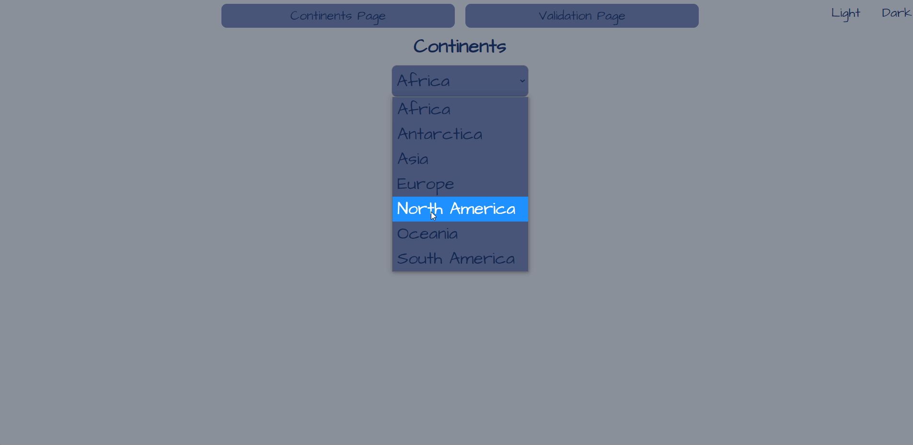

# Countries

> After you cloned the application to your computer,
>
> ### `git clone https://github.com/dzmitry-rubashka/countries.git`
>
> open the project directory and run
>
> ### `npm install`
>
> to install all dependencies for the project.
> To start the project run
>
> ### `npm start`
>
> and use it in opened browser window with application.
>
> The page will reload if you make edits.\
> You will also see any errors in the console.